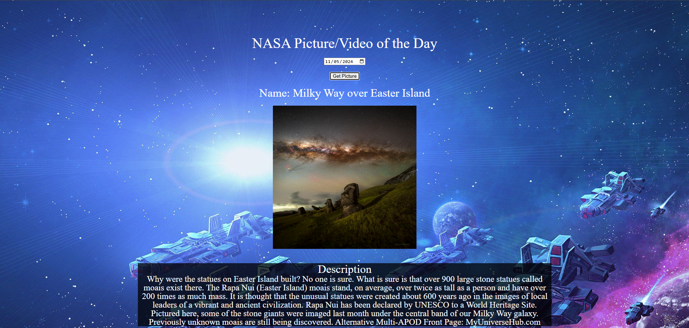

# NASA Picture of the DAY API

Link to project: (https://simplenasaoftheday.netlify.app/)

## How It's Made:
Tech used: HTML, CSS, JS

Application where users can pick the current date or a previous date and receive a NASA video or image from that date, along with a description of the media.

